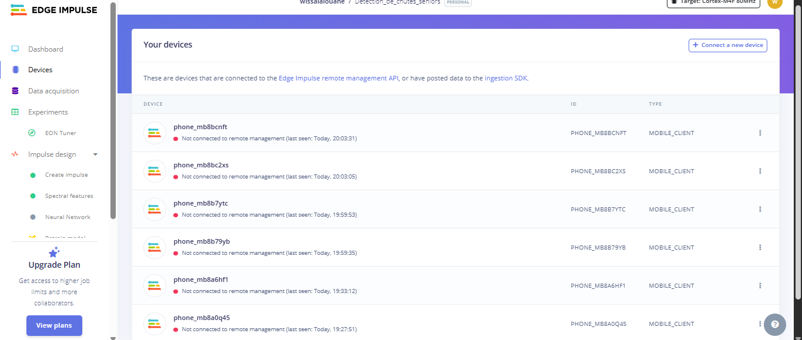
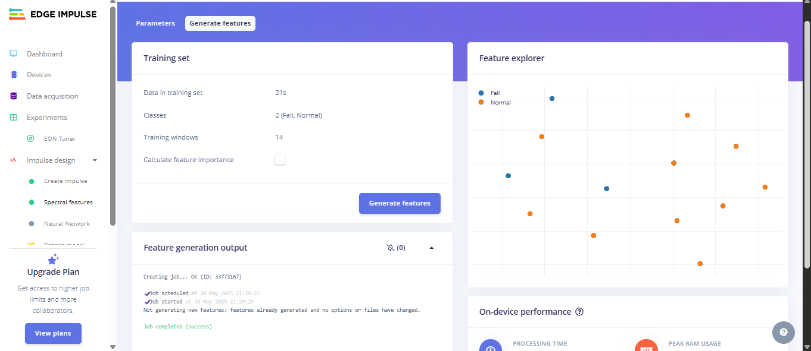
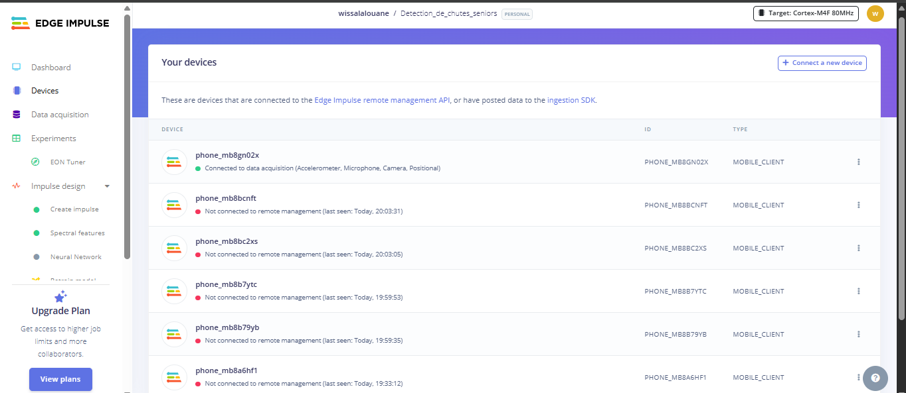
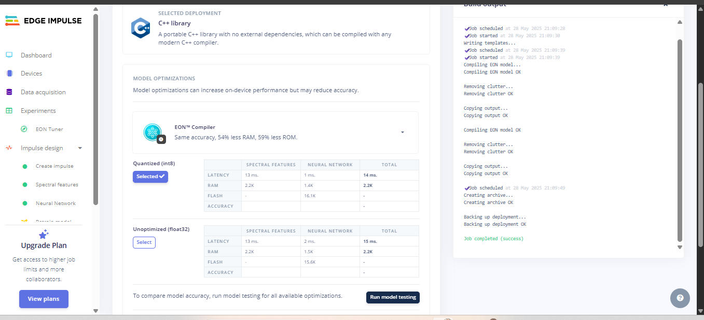
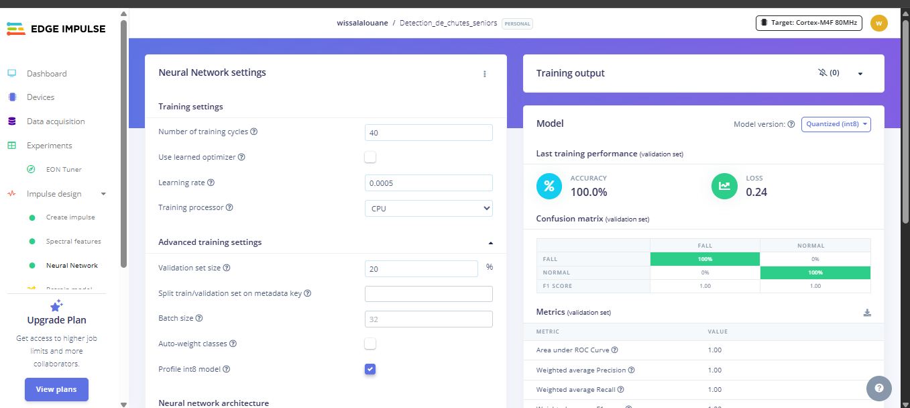
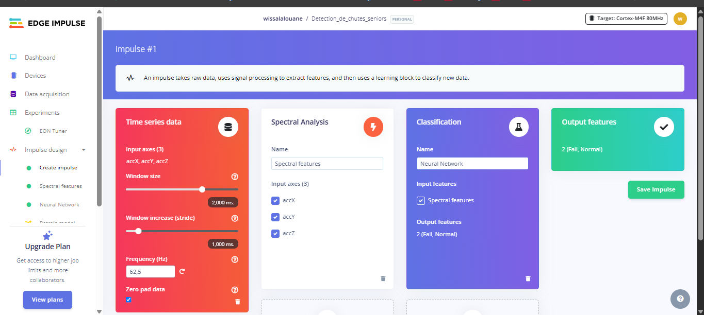

# 🧠 Détection de Chute (TinyML) – Edge Impulse + Arduino

Ce projet utilise un modèle IA embarqué (TinyML) pour détecter les chutes de personnes âgées à partir des données d'accéléromètre (MPU6050). Il a été entraîné sur Edge Impulse et préparé pour une intégration sur Arduino.

## 🔧 Outils utilisés
- 📱 Téléphone (Edge Impulse App) pour collecter les données
- 🤖 Edge Impulse pour entraîner le modèle IA
- 🧠 Modèle IA (Neural Network + Spectral Features)
- 🎯 Précision obtenue : **100 %** sur le jeu de validation

## 🚫 Pas de matériel ? Pas de souci !
Ce projet est **100% reproductible sans matériel** grâce à :
- La collecte de données via smartphone
- La simulation et le test via WebAssembly dans le navigateur

## 📦 Structure
- `detection_chute.ino` : code Arduino pour MPU6050 + inférence
- `edge-impulse-sdk/` : SDK IA embarqué
- `model-parameters/` : métadonnées du modèle
- `tflite-model/` : modèle optimisé

## 🖼 Démo visuelle

### 📱 Téléphone connecté à Edge Impulse

### ⚙️ Génération des features

### 🔄 Téléphone détecté avec succès

### 🌐 Modèle prêt au déploiement

### 📊 Résultats d'entraînement (précision 100%)

### ⚙️ Architecture du modèle IA (Impulse)

## 🎥 Vidéo de démonstration

Regarde la détection IA en action :

[▶️ Voir la vidéo sur YouTube](https://youtube.com/shorts/MApXynli6vY?si=t-S4XPtjq8SCHfLB)

## 🔗 Liens
- 📡 Entraîné et testé sur Edge Impulse Studio (projet privé)
- [Post LinkedIn associé](URL à venir)

